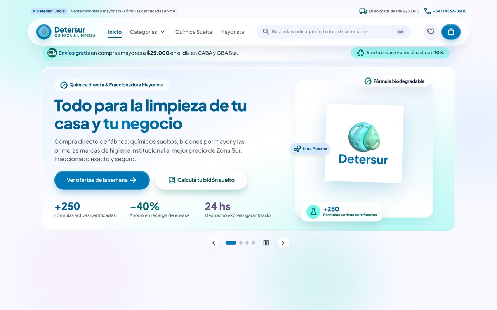
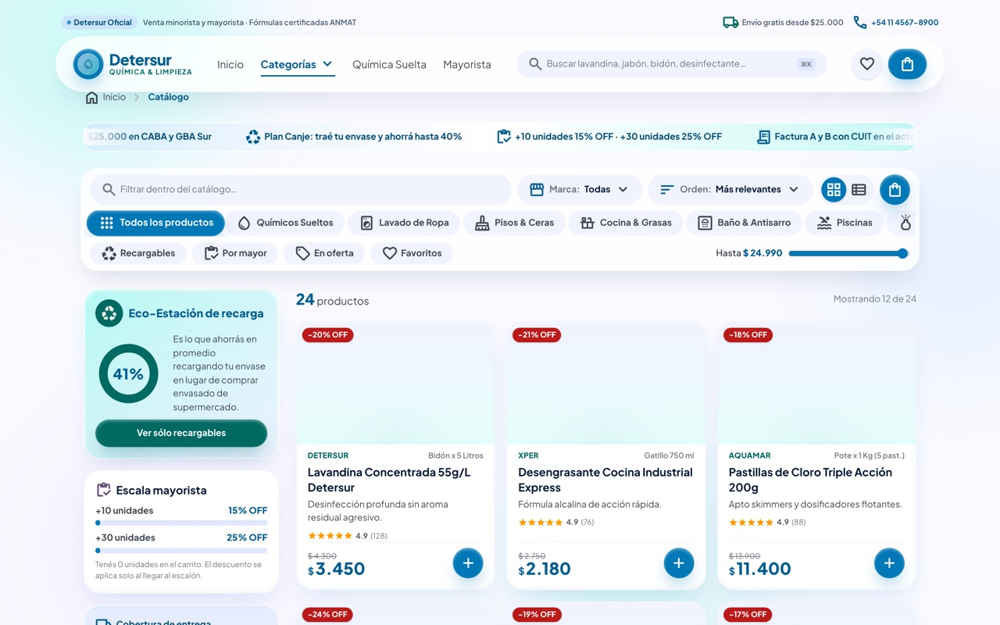
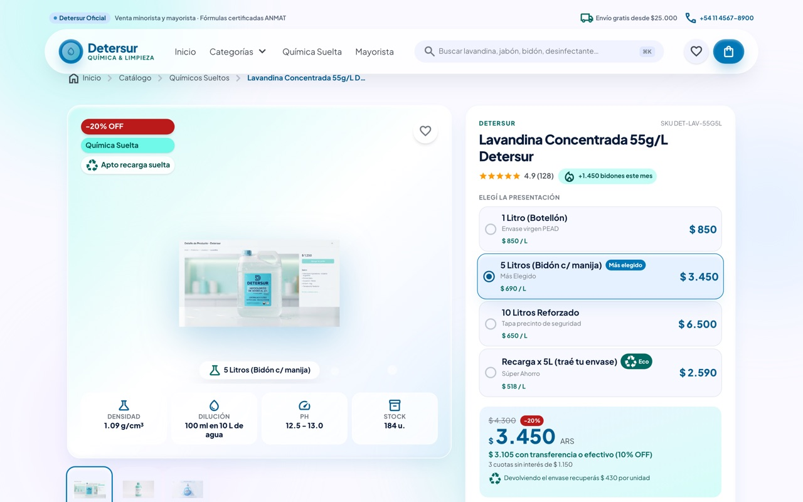
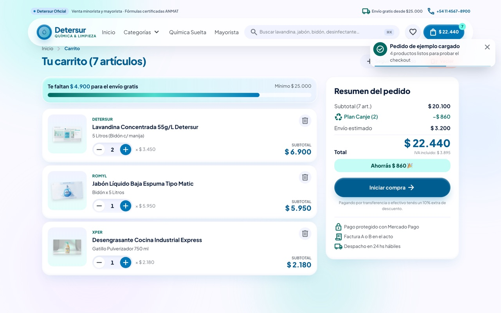
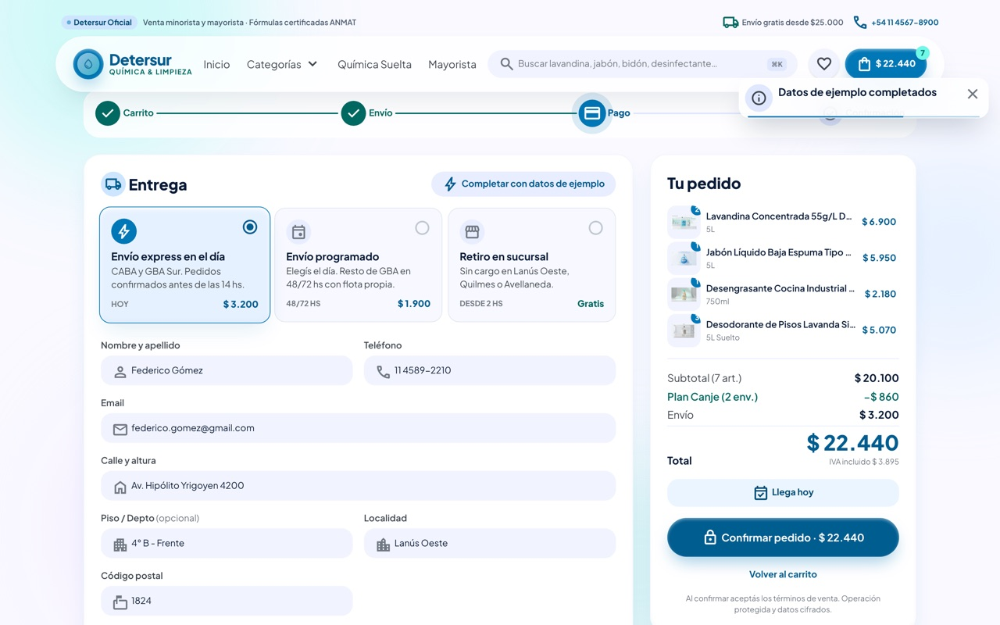
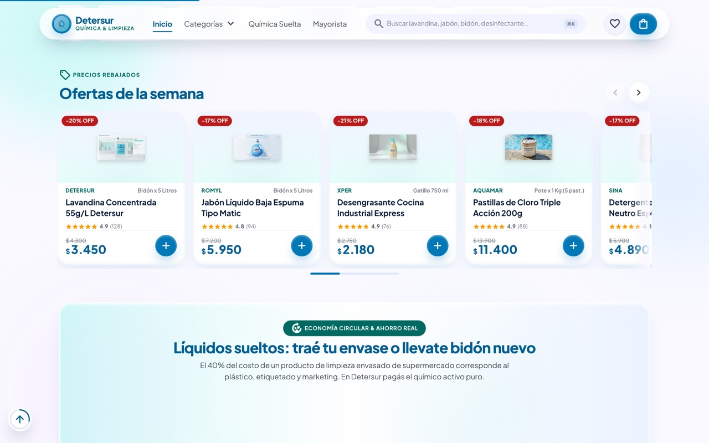

<div align="center">

# Detersur — Tienda online

**Demo funcional de e-commerce** para una distribuidora de productos químicos y
de limpieza de Zona Sur (GBA). Catálogo, carrito, checkout y seguimiento de
pedido funcionando de punta a punta, sin backend.

React 19 · TypeScript strict · Vite 8 · Tailwind CSS 4



</div>

---

## Arrancar

```bash
npm install
npm run dev      # http://localhost:3000
```

| Comando | Qué hace |
|---|---|
| `npm run dev` | Servidor de desarrollo con HMR |
| `npm run build` | Bundle de producción en `dist/` (~128 kB gzip) |
| `npm run preview` | Sirve el build de producción |
| `npm run lint` | Chequeo de tipos con `tsc --noEmit` |

No necesita variables de entorno ni servicios externos.

### Dos atajos para probarlo rápido

Como no hay backend ni sesión, hay dos botones que precargan datos para no
tener que tipear todo a mano:

- **"Cargar pedido de ejemplo"** — en el carrito vacío, mete 4 productos.
- **"Completar con datos de ejemplo"** — en el checkout, llena el formulario.

---

## Qué incluye

### Pantallas

| | |
|---|---|
|  |  |
| **Catálogo** — filtros, orden, grilla/lista, paginado | **Ficha de producto** — galería, presentaciones, pestañas, reseñas |
|  |  |
| **Carrito** — Plan Canje, progreso a envío gratis | **Checkout** — validación por campo, factura A/B |
|  |  |
| **Confirmación** — tracking en vivo, comprobante | **Carruseles** — arrastre, swipe, teclado, dots |

### Responsive

<div align="center">

&nbsp;&nbsp;&nbsp;

</div>

Diseño mobile-first real: header con hamburguesa y drawer con acordeones, nav
inferior fija, y cero scroll horizontal en 390 px.

---

## Cómo está organizado

```
src/
├── data/         catálogo (24 productos) y contenido editorial
│   ├── products.ts    productos, presentaciones, reseñas, stock
│   └── content.ts     slides, testimonios, FAQs, sucursales, reglas comerciales
├── lib/
│   ├── pricing.ts     toda la matemática de precios (fuente única de verdad)
│   ├── format.ts      formato de pesos argentinos, fechas, normalización
│   └── storage.ts     localStorage a prueba de fallos
├── hooks/        routing por hash, scroll reveal, contadores, media queries
├── context/      StoreContext: carrito, favoritos, toasts, pedido
├── components/   header, footer, carruseles, tarjetas, drawer, modales
└── views/        inicio, catálogo, producto, carrito, checkout, confirmación
```

### Routing

La vista vive en el hash de la URL, así que **el botón atrás del navegador
funciona** y cada pantalla se puede compartir por link:

| URL | Pantalla |
|---|---|
| `#/inicio` | Home |
| `#/catalogo` | Catálogo completo |
| `#/catalogo?cat=sueltos&q=lavandina` | Catálogo con categoría y búsqueda aplicadas |
| `#/producto/lavandina-55g` | Ficha de producto |
| `#/carrito` · `#/checkout` · `#/confirmacion` | Flujo de compra |

Implementado en [`src/hooks/index.ts`](src/hooks/index.ts) (`useHashRoute`), sin
dependencia de router.

### Reglas comerciales

Toda la matemática vive en [`src/lib/pricing.ts`](src/lib/pricing.ts), que es la
única fuente de verdad para el drawer, el carrito, el checkout y el comprobante
— así ninguna pantalla puede mostrar un número distinto a otra.

Los descuentos se acumulan **en este orden**:

| # | Concepto | Regla |
|---|---|---|
| 1 | **Escalón mayorista** | +10 unidades → 15% · +30 unidades → 25%, sobre el subtotal |
| 2 | **Plan Canje** | $430 de crédito por cada envase retornable declarado |
| 3 | **Medio de pago** | 10% extra por transferencia o efectivo |
| 4 | **Envío** | Gratis desde $25.000. Si no: express $3.200 / programado $1.900 / retiro $0 |

El IVA (21%) se muestra como **monto contenido**, siguiendo la convención
argentina de precios finales. Los parámetros son editables en
[`src/data/content.ts`](src/data/content.ts).

<details>
<summary>Ejemplo verificado de un pedido real</summary>

```
Subtotal (7 unidades)                   $ 20.100
Plan Canje (6 envases × $430)          − $  2.580
Transferencia (10% de $17.520)         − $  1.752
Envío express                          + $  3.200
─────────────────────────────────────────────────
Total                                    $ 18.968
IVA 21% contenido                        $  3.292
```
</details>

### Persistencia

Carrito, favoritos, búsquedas recientes, dirección y último pedido se guardan en
`localStorage`. Todos los accesos están envueltos en `try/catch`
([`src/lib/storage.ts`](src/lib/storage.ts)) porque el almacenamiento falla en
ventanas privadas o con site data bloqueada; si no está disponible, la app
sigue funcionando en memoria.

El carrito se guarda **por id de producto**, no como copia del objeto, y se
rehidrata contra el catálogo al cargar. Así un cambio de precio siempre le gana
a un carrito viejo guardado.

---

## Animaciones

Los keyframes y las utilidades `animate-*` están en
[`src/index.css`](src/index.css). Hay tres mecanismos:

- **Entrada al hacer scroll** — el componente `<Reveal>` usa
  `IntersectionObserver` + una transición CSS, así que no cuesta nada mientras
  está quieto y no corre JS por frame.
- **Decorativas en bucle** — burbujas que suben, flotación, marquee, ondas,
  brillo al pasar el mouse, gradiente animado en el título.
- **De estado** — toasts, badges del carrito, barras de progreso, contadores
  que cuentan al entrar en pantalla, y el check del pedido confirmado
  dibujándose con `stroke-dashoffset`.

Todo respeta **`prefers-reduced-motion`**: con la preferencia activada, el
movimiento decorativo se apaga y quedan sólo los cambios de opacidad.

## Carruseles

Tres componentes reutilizables en
[`src/components/Carousel.tsx`](src/components/Carousel.tsx):

| Componente | Uso | Características |
|---|---|---|
| `ScrollCarousel` | Rieles de productos | Scroll-snap, flechas, arrastre con mouse, swipe, teclado, dots, barra de progreso, fundidos en los bordes |
| `SlideCarousel` | Hero y testimonios | Un slide por vez, autoplay pausable, variantes slide/fade, swipe, teclado |
| `Marquee` | Marcas y avisos | Cinta infinita que se pausa al hover |

El autoplay del `SlideCarousel` se pausa solo al pasar el mouse, al enfocar con
teclado, **al salir del viewport** y **al ocultarse la pestaña** — para no
quemar batería animando algo que nadie está mirando.

---

## Decisiones técnicas

**Sin librería de animación.** El repo traía `motion` como dependencia pero no
se importaba en ningún archivo. Terminé resolviendo todo con CSS +
`IntersectionObserver`: pesa menos y no bloquea el hilo principal.

**Sin router.** Para seis pantallas, `useHashRoute` son ~40 líneas y evita una
dependencia.

**Un solo contexto.** `StoreContext` concentra carrito, navegación, favoritos y
toasts. A esta escala, partirlo en cuatro providers agregaría ceremonia sin
ganancia real.

**TypeScript en modo strict**, con `noUnusedLocals` y `noUnusedParameters`.

---

## Verificación

El demo fue probado en Chromium headless (Playwright) en las 7 vistas, en
escritorio y en móvil:

- **0 errores de consola** en todas las pantallas
- Flujo de compra completo: carrito → checkout → confirmación → comprobante
- Validación del checkout, incluyendo los campos fiscales de factura A
- Escalones mayoristas verificados en los tres tramos (9, 10 y 30 unidades)
- Persistencia del carrito al recargar
- Botón atrás del navegador
- Sin scroll horizontal a 390 px

---

## Limitaciones conocidas

Es una demo, no una tienda en producción:

- **No hay backend.** El pago y el seguimiento del pedido están simulados con
  temporizadores. No se procesa ninguna transacción real.
- **Las imágenes de producto** se sirven desde un CDN remoto cuyos enlaces
  pueden expirar. `SmartImage` detecta la falla y dibuja un glifo de marca en
  lugar del ícono de imagen rota, así que la tienda se sigue leyendo bien.
- **El stock no se descuenta** al confirmar un pedido.
- **No hay cuentas de usuario**; los datos viven en el `localStorage` del
  navegador.
